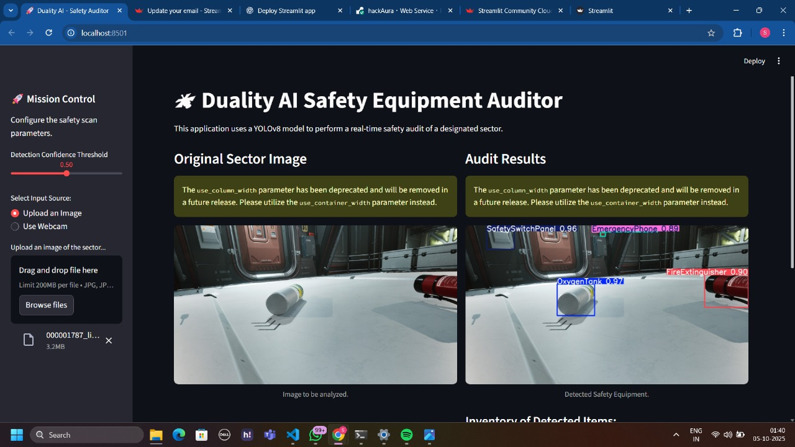
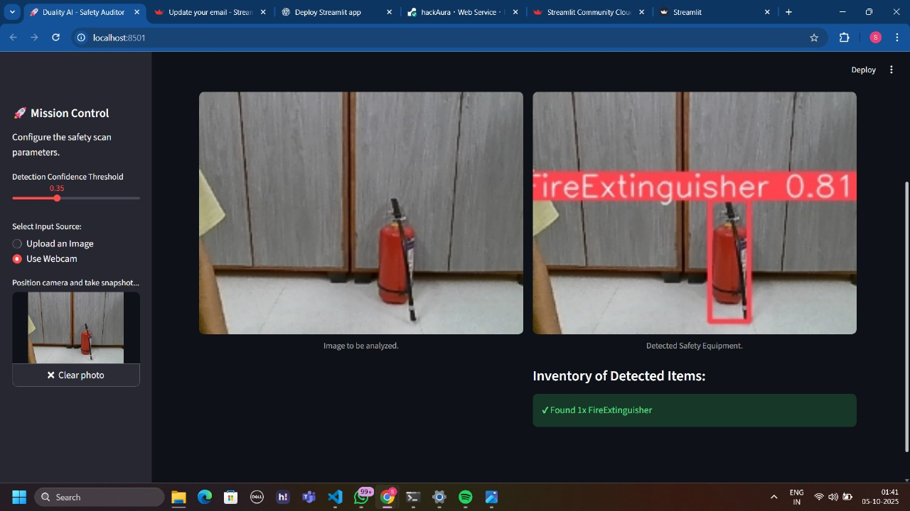

# Duality AI Space Station Safety Auditor

**An AI-powered application for real-time safety compliance monitoring in space stations, trained on high-fidelity synthetic data from Duality AI's Falcon platform.**

This project is a submission for the Duality AI's Space Station Challenge: Safety Object Detection. Our solution involves a highly accurate YOLOv8 model and an interactive web application designed to automate the critical task of safety equipment auditing.

---

## 🚀 Live Demo

You can access and interact with our live application, deployed on Render, at the following URL:

**[➡️ Click here to launch the Safety Auditor App](https://hackaura-f5bdbac9appv32pwoxxd5mj.streamlit.app/)**


---
## 📄 Project Report

For a detailed walkthrough of our methodology, challenges, and results, please view our full project report.

**[➡️ View Our Full Project Report (Space_Station_Challenge_Report.docx)](Space_Station_Challenge_Report.docx)**

---

## 🏆 Final Results

Our final optimized model achieved an outstanding **mAP@0.5 score of 80.1%** on the provided test dataset, significantly exceeding the baseline benchmark of 40-50%.


---

## 🖼️ Application Preview

Our space-themed application provides a clean and intuitive interface for safety audits. Users can either upload an image or use a live webcam feed.


* Results   
* Results Using Webcam   

---

## ✨ Key Features

* **High-Performance Detection Model:** A fine-tuned YOLOv8s model that accurately detects 7 classes of safety equipment with 80.1% mAP@0.5.
* **Interactive Web Application:** A user-friendly and space-themed web app built with Streamlit for easy interaction.
* **Real-Time Audit Capability:** Supports both file uploads and live webcam snapshots for immediate safety checks.
* **Adjustable Confidence:** A slider in the UI allows users to filter detections based on their confidence score.
* **Proven Optimization Journey:** We documented a clear path of improvement, increasing our model's performance from a **58.6% mAP baseline to a final 80.1% mAP**.

---

## 🛠️ Tech Stack

* **Model:** YOLOv8s (Ultralytics)
* **Frameworks:** PyTorch, Streamlit
* **Core Libraries:** OpenCV, Anaconda, YAML
* **Platform:** Duality AI's Falcon (for synthetic dataset generation)
* **Deployment:** Render

---

## 📂 Project Structure

```
├── runs/                # Contains training logs, weights, and results for all experiments
├── ENV_SETUP/           # Environment setup scripts
├── app.py               # The main script for the Streamlit web application
├── best.pt              # The final, best-performing trained model weights
├── predict.py           # Script to run evaluation and get performance metrics
├── train.py             # Script to train the YOLOv8 model
├── yolo_params.yaml     # Configuration file for the dataset paths and classes
├── requirements.txt     # Pip requirements file for deployment
└── README.md            # This file
```

---

## ⚙️ Setup and Installation (Local Reproduction)

To run this project locally, please follow these steps:

1.  **Clone the Repository**
    ```bash
    git clone [your-github-repo-link]
    cd [your-repo-name]
    ```

2.  **Create the Anaconda Environment**
    Our project uses a dedicated Conda environment named `EDU` to manage dependencies.

    * **For Windows:**
        Navigate to the `ENV_SETUP` directory and run the provided batch script.
        ```bash
        cd ENV_SETUP
        setup_env.bat
        ```
    * **For Mac/Linux:**
        Navigate to the `ENV_SETUP` directory and run the shell script.
        ```bash
        cd ENV_SETUP
        bash setup_env.sh
        ```

3.  **Activate the Environment**
    Once the setup is complete, activate the Conda environment.
    ```bash
    conda activate EDU
    ```
3.  **Download training and testing datasets**
    * **[➡️ Training](https://storage.googleapis.com/duality-public-share/Datasets/hackathon2_train_3.zip)**
    * **[➡️ Testing](https://storage.googleapis.com/duality-public-share/Datasets/hackathon2_test3.zip)**
   
---

## 🏃‍♀️ Usage / How to Run

All commands should be run from the root directory of the project.

### 1. Evaluate the Model
To evaluate our final `best.pt` model and reproduce the 80.1% mAP score, run the prediction script:
```bash
python predict.py
```
This will generate performance metrics and save predictions in the `predictions/` folder.

### 2. Train the Model from Scratch
To run the training process for 100 epochs, use the training script:
```bash
python train.py
```
Results, including model weights and graphs, will be saved to a new folder inside `runs/detect/`.

### 3. Launch the Web Application
To launch the interactive Streamlit app locally, run the following command. Your browser will open with the application.
```bash
streamlit run app.py
```
